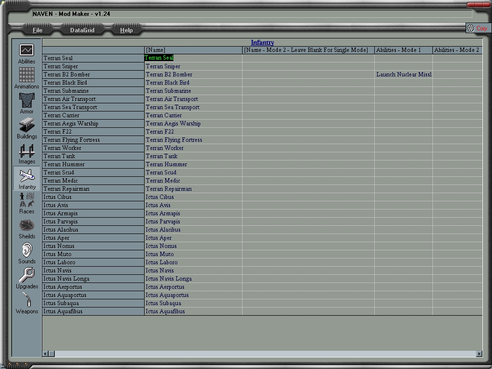



## NAVEN \- Mod Maker

### Description

This is another part of the open-source game i am making..when finished it will be allot like starcraft, the engine is currently useing square tiles...but if you know a way to do diagnal ones without using a sprite for each tile then my icq is: 94958901, plz report any bugs you find as well...this prog will be used to create the races,charactors,buildings,sounds,images,animations,weapons,upgrades,abilities,armors, and shields for the game, i will also upload the Skin Art prog today, after that will be either a new version of the tile editor(for diagonal tiles) or the beta version of the map editor(using square or diagonal tiles), the only thing that may not ever be submited is the module to connect to the server...though the game will be...i think i also forgot to mention that there may or may not be any AI in the first version of the game...but there will be a multi-player option and a server open to connect to with 12 players per game(or less)...also if you have vb5 you will need to make replacements for the split/replace functions i use in the save/open routines
 
### More Info
 

             |
---                |---
**Submitted On**   |2001-03-10 11:21:56
**By**             |[Cory J\. Geesaman](https://github.com/Planet-Source-Code/PSCIndex/blob/master/ByAuthor/cory-j-geesaman.md)
**Level**          |Intermediate
**User Rating**    |4.0 (16 globes from 4 users)
**Compatibility**  |VB 6\.0
**Category**       |[Complete Applications](https://github.com/Planet-Source-Code/PSCIndex/blob/master/ByCategory/complete-applications__1-27.md)
**World**          |[Visual Basic](https://github.com/Planet-Source-Code/PSCIndex/blob/master/ByWorld/visual-basic.md)
**Archive File**   |[CODE\_UPLOAD170733142001\.zip](https://github.com/Planet-Source-Code/cory-j-geesaman-naven-mod-maker__1-21641/archive/master.zip)

